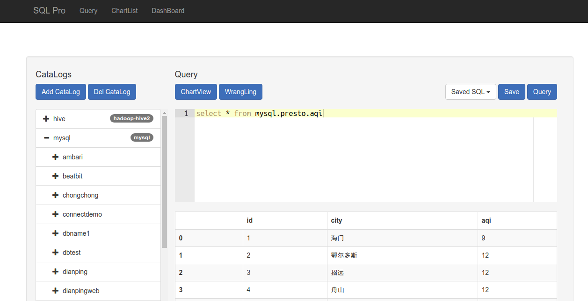
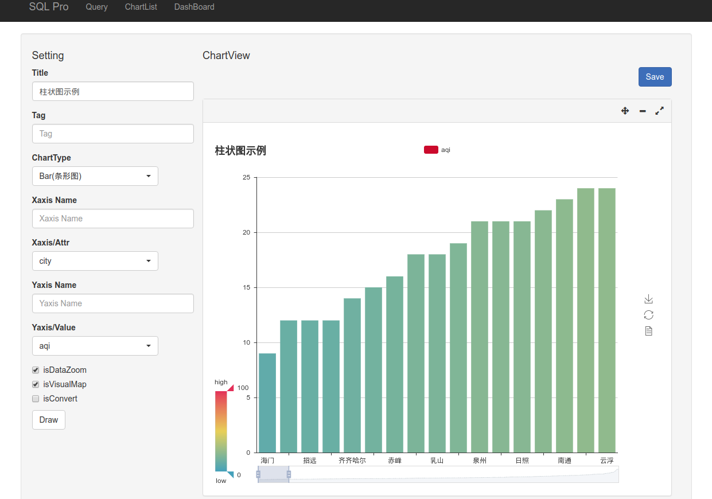
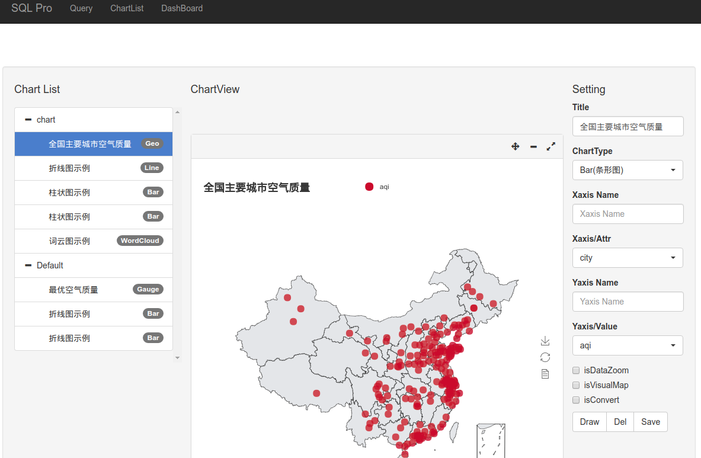
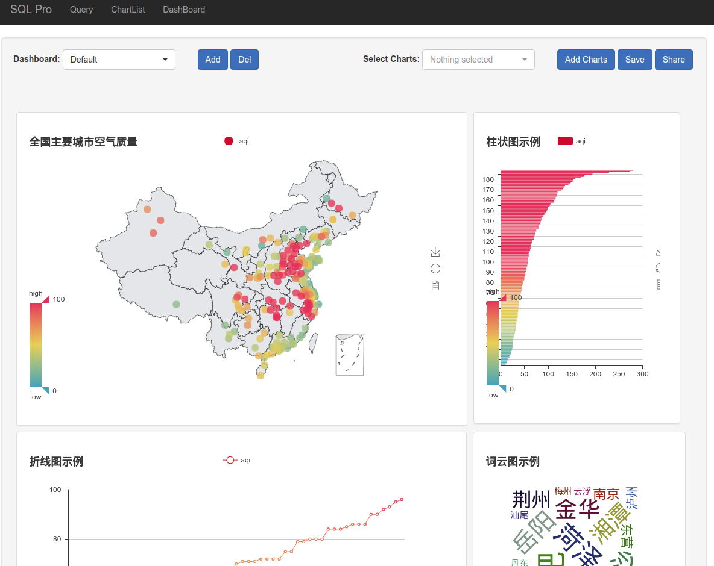

# SQL_PRO by prest and pyecharts

这是一个数据查询和可视化的简单示例。
This is a simple project for data query and data visualization.

项目基于python flask web框架，其功能依赖于presto和pyecharts。
The project is powered by flask web frame, all features are based on presto and pyecharts.

Easy Start

1. git clone git@github.com:Ji3jin/presto.git -b acdev  then update presto-main.jar to support add catalog by http api.
从我fork的presto的acdev分支获取代码，编译presto-main模块，以支持通过api动态更新catalog（基于mysql）
2. git clone git@github.com:Ji3jin/sqlpro.git
3. change the config.py and exec python manage.py runserver

Demo

